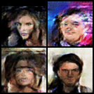
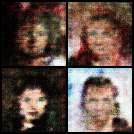
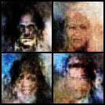

Implementation of a Modified Deep Convolutional Generative Adversarial Network (mDCGAN) convolutional neural network for face generation, using PyTorch. During development, various experiments were conducted with the model architecture and hyperparameter values.

Experiment 1:

Experiment 2:

Experiment 3:

